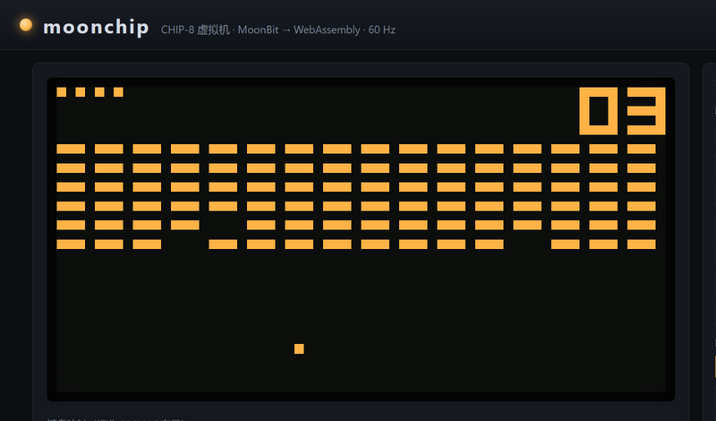
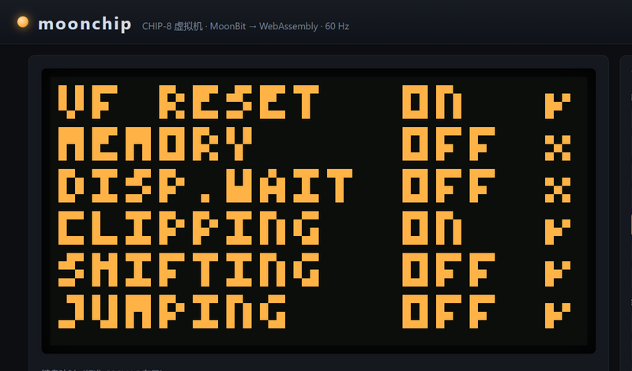

# moonchip

A **CHIP-8 virtual machine** written in [MoonBit](https://www.moonbitlang.com/)
and compiled to WebAssembly — fetch/decode/execute, 64×32 display, timers,
keypad and sound, running real games in the browser and verified against the
Timendus test suite.



Insert a cartridge (Brix, Space Invaders, Blinky, Pong, Tank…), play with the
on-screen keypad or the classic keyboard mapping (`1234 / qwer / asdf / zxcv`),
and watch the CPU state panel tick. The beeper is a WebAudio square wave
gated by the VM's sound timer.

## The VM

- **35 opcodes**, 4 KB RAM, 16 registers, 16-level stack, 60 Hz
  delay/sound timers, font at `0x50`, ROMs at `0x200`.
- **Quirk switches** model the famous peripheral differences between the
  original COSMAC VIP and later SUPER-CHIP interpreters: VF reset on logic
  ops, I increment on `FX55`/`FX65`, shift source register, sprite edge
  clipping, display wait. Toggle them live in the UI and re-run the quirks
  test suite to see the difference on screen.
- **Deterministic core** — randomness comes from an internal xorshift PRNG
  the host seeds; a given ROM + inputs + seed replays byte-exactly (pinned
  by a kernel test).
- Halt conditions (stack under/overflow, unknown opcodes, `00FD` exit) stop
  cleanly and surface in the UI instead of corrupting state.

## The wasm boundary

The VM lives on the MoonBit (GC) side. Each frame the host calls
`tick(instructions)`, then reads the freshly rendered 64×32 bitmap straight
out of linear memory into an `ImageData` — one call, one copy, no per-pixel
crossing. ROMs cross as raw bytes into a staging region; keypad events,
quirk toggles and the debug state (`pc/i/sp/dt/st/V0..VF`) are plain
exported calls. On a 2024 laptop the emulator runs at **millions of
frames per second** — the 60 Hz loop is throttled deliberately, not out of
necessity.

## Verification

The project uses the [Timendus test suite](https://github.com/Timendus/chip8-test-suite)
as its external oracle — included in the cartridge library:



The suite detects the running quirk configuration on screen (above: VF reset
ON, memory OFF, display-wait OFF, clipping ON — matching this build's
defaults; display-wait is not implemented). During development the suite
caught two real decoding bugs the unit tests had missed: the `5XY0`/`9XY0`
qualifier lives in the *low* nibble, not in `Y`, and `00FD` (exit) must be
matched as a full opcode — both fixed and pinned by tests.

## Layout

```
src/lib/        the VM core: opcode interpreter, drawing with XOR/collision,
                timers, keypad, PRNG, quirk switches (16 unit tests over
                hand-assembled programs)
src/kernel/     wasm foreign_library: moon_init / load_rom / tick / key_down /
                render_display / state_out / set_quirk / ram_peek / ...
web/            console UI (canvas phosphor display, cartridge library,
                keypad, sound, live CPU panel), kernel test suite,
                zero-dependency server, public-domain ROM library
```

## Try it

```
moon build --target wasm --release
cp _build/wasm/release/build/src/kernel/kernel.wasm web/moonchip.wasm
node web/server.mjs 8097
# open http://127.0.0.1:8097
```

Pick a cartridge. IBM logo animates instantly; Brix starts with key 1, paddle
on keys 4/6. The 5-quirks cartridge renders the platform picker — choose
CHIP-8 to see this build's quirk verdicts.

## Tests

- **VM core**: `moon test` — 16 unit tests over hand-assembled programs:
  arithmetic carry/borrow flags, logic-ops VF quirk (both modes), shift
  quirks (both modes), jumps/calls/skips, BCD, `FX55` with and without the
  I increment, sprite XOR-erase + collision, edge clipping, font lookup,
  timers, `FX0A` key waiting, seeded determinism, clean stack-overflow halt.
- **Kernel**: `node web/test-kernel.mjs` — 14 end-to-end checks through the
  wasm boundary, including real ROM runs: IBM logo lights 230 pixels,
  chip8-logo animates 120 frames, 7-beep drives the sound timer, Brix renders
  its title screen, and a seeded random-sprite run reproduces identically.

## ROM licenses

`web/roms/` contains the Timendus test suite (MIT) and classic freeware/
public-domain games collected by the [kripod/chip8-roms](https://github.com/kripod/chip8-roms)
archive (Brix © Andreas Gustafsson, Space Invaders © David Winter, Blinky ©
Hans Christian Egeberg, Pong, Tank). All are freely redistributable; see the
archive for per-ROM details.

## Requirements

- MoonBit CLI (developed on 0.1.20260920) — `moon build --target wasm --release`
- Node.js 18+ for the dev server and kernel tests
- Any modern browser with WebAssembly for the console

## License

[Apache-2.0](LICENSE)
